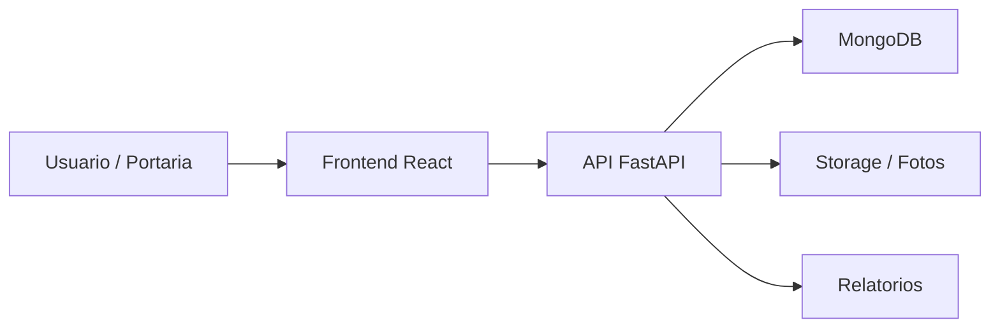

# Controle de Acesso Operacional 1.0

Sistema web para controle operacional de acesso, portaria, visitantes, diretoria, frota, carregamentos, agendamentos, relatorios e fotos de evidencia.

## Visao Geral

O projeto organiza rotinas de portaria e controle de acesso em uma aplicacao web integrada. A interface em React se comunica com uma API FastAPI, que centraliza autenticacao, registros operacionais, consultas e relatorios em uma base MongoDB.

## Problema Resolvido

O sistema foi desenvolvido para apoiar equipes de portaria e operacoes que precisam registrar entradas, saidas, veiculos, visitantes, funcionarios, frota e carregamentos de forma rastreavel e consultavel.

## Principais Funcionalidades

### Funcionalidades Disponiveis

- Login e controle de sessao.
- Gestao de visitantes.
- Controle de funcionarios.
- Controle de diretoria.
- Controle de frota.
- Controle de carregamentos.
- Agendamentos por modalidade.
- Relatorios por filtros.
- Upload e consulta de fotos de evidencia.
- Painel com indicadores operacionais.
- Gestao de usuarios e perfis.

### Funcionalidades Em Desenvolvimento

- Ajustes de relatorios, agendamentos e upload de fotos aparecem nos arquivos de acompanhamento do projeto.

### Funcionalidades Planejadas

- Nao ha roadmap publico consolidado no repositorio.

## Como Funciona

```text
Usuario acessa o sistema
-> realiza autenticacao
-> seleciona um modulo operacional
-> registra entrada, saida, agendamento ou evidencia
-> o backend valida e processa a solicitacao
-> os dados sao armazenados no MongoDB
-> relatorios e consultas ficam disponiveis para acompanhamento
```

## Tecnologias Utilizadas

- Python
- FastAPI
- MongoDB
- React
- Tailwind CSS
- Axios
- JWT
- Bcrypt
- jsPDF
- xlsx

## Arquitetura



## Estrutura Do Projeto

- `backend/`: API, autenticacao, modelos, rotas, persistencia e servicos de foto.
- `frontend/`: interface web, paginas, componentes, contexto de autenticacao e integracao com API.
- `tests/`: estrutura auxiliar de testes.
- `test_reports/` e `memory/`: artefatos de acompanhamento presentes nesta versao.

## Status

Versao antiga / historica de sistema de controle de acesso. Existe tambem uma versao posterior relacionada.

## Minha Participacao

Projeto desenvolvido e organizado por Michele Santana, com foco em sistemas operacionais, automacao e apoio a rotinas de portaria.

## Autor

Desenvolvido por Michele Santana — Kalion Tecnologia
